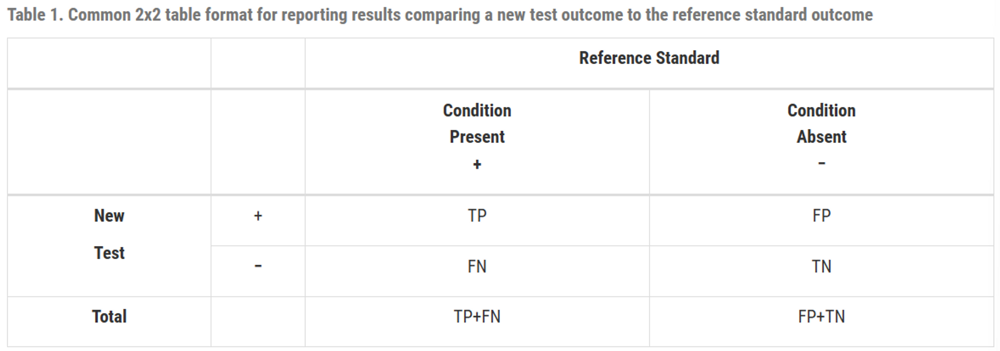
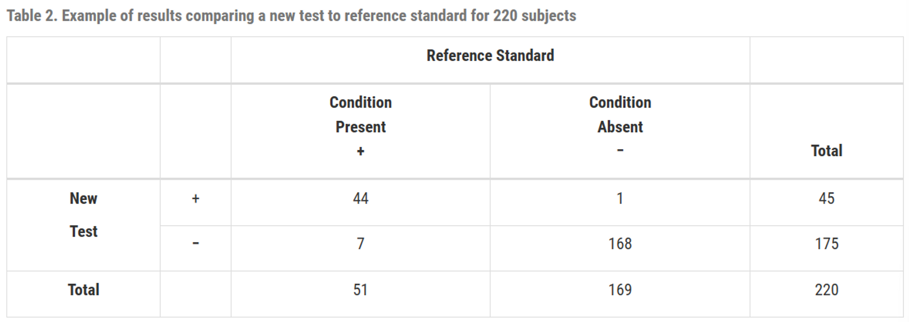
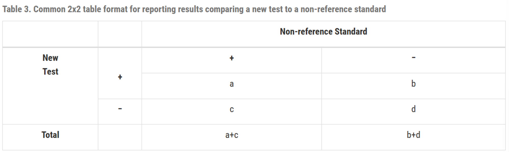
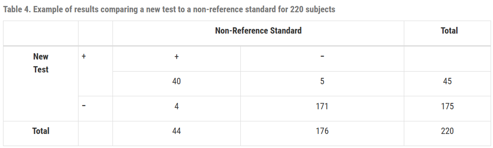
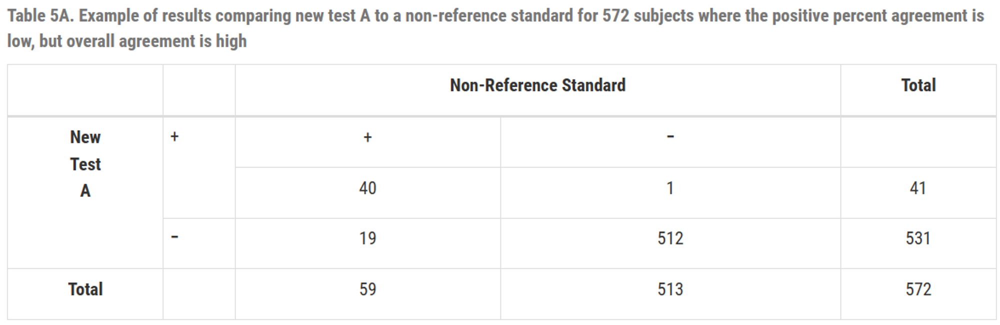
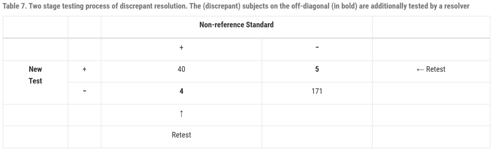
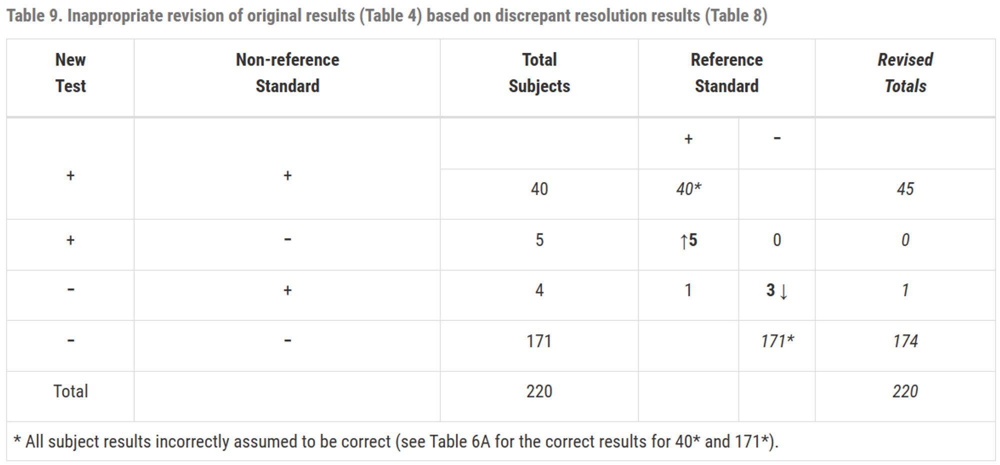

# Statistical Guidance on Reporting Results from Studies Evaluating Diagnostic Tests - Guidance for Industry and FDA Staff part 2

# 5. Reporting Recommendations : 권장사항 보고

진단 검사를 평가하는 모든 연구에 유사한 보고 원칙이 적용됨

### (1) **Reporting the context of the study : 연구 맥락 보고**

- 성능 측정치은 연구 모집단 및 연구설계의 맥락에서 해석돼야함
- 민감도와 특이도는 그 자체로 해석 불가하며 추가 정보가 필요함. 
연구에 포함된 모집단의 특성이나 참조 표준 (현재 사용되는 reference standard인지, 오래된 reference standard인지)에 따라 달라질 수 있기 때문.
- FDA 권장 사항
    - intended use population (예정 사용군) : 제품의 타겟이 되는 모든 대상
    - study population (연구 집단) : 실제 연구에 참여한 사람들
    - condition of interest : 관심 조건에 해당되는 대상과 아닌 대상을 어떻게 구별하는지 정확히 정의
    - designated comparative benchmark (reference standard)
    - comparative benchmark의 선택 근거
    - comparative benchmark의 선택으로 인해 발생할 수 있는 강점 또는 한계

### (2) Defining the conditions of use : 사용 조건 정의

- FDA는 candidate test와 reference standard가 수행되는 조건을 정의할 것을 권장
    - operator experience : 테스트를 수행하는 사람의 전문성 또는 경험
    - clinical laboratory facility or other test setting : 실험이 수행되는 환경
    - controls applied : 테스트의 정확성과 신뢰성을 보장하기 위해 사용되는 기준 또는 절차
    - specimen acceptance criteria(표본 승인 기준) : 표본을 승인할 때 따르는 기준
    

### (3)  **Descriptions of comparative results and methods : 비교 결과 및 방법에 대한 설명**

- FDA는 연구에 사용된 모든 방법과 데이터 수집 방식에 대한 명확한 설명을 포함할 것을 권장
    - subject recruitment procedures (대상 모집 절차) : 연구 참가자를 어떻게 모집했는지에 대한 절차
    - subject demographics (대상의 인구통계학적 정보) : 참가자들의 연령, 성별, 인종, 건강상태 등의 정보
    - subject and specimen inclusion and exclusion criteria (대상 및 표본의 포함 및 배제 기준) : 연구에 참여하거나 표본으로 사용될 수 있는 조건, 그리고 연구나 표본에서 배제되는 조건
    - specimen collection procedures (표본 수집 절차) : 표본을 어떻게 수집했는지에 대한 방법
    - time of specimen collection and testing (표본 수집 및 검사 시간) : 표본이 언제 수집되었고 검사되었는지에 대한 시간 정보
    - types of specimens collected (수집된 표본의 종류) : 수집된 표본의 다양한 유형 (예: 혈액, 체액, 조직 등)
    - number of specimens collected and tested and number discarded (수집 및 검사된 표본의 수와 폐기된 표본 수) : 테스트에 사용된 표본의 총 수, 검사된 표본의 수, 그리고 사용되지 않고 폐기된 표본의 수
    - number of specimens included in final data analysis (최종 데이터 분석에 포함된 표본의 수) : 최종적으로 분석에 사용된 표본의 수
    - specimen collection devices (if applicable) (표본 수집 장치) : 표본 수집에 사용된 특정 장치나 도구 (해당되는 경우)
    - specimen storage and handling procedures (표본 보관 및 처리 절차) : 표본을 저장하고 다루는 방법 및 절차
    

### (4) Reporting study results : 연구 결과 보고

- FDA는 항목 별로 모든 결과 보고할 것을 권장
    - clinical site or specimen collection site (임상 현장 또는 표본 수집 현장 별 결과)
    - specimen testing or processing site (표본 검사 또는 처리 현장 별 결과)
    - relevant clinical and demographic subgroups (관련 임상 및 인구통계학적 하위 그룹 별 결과)
- 보고 방법
    - Tabular comparisons (표)
    - Measures of accuracy *:* 정확도 측정치 (ex. 민감도와 특이도, 가능도비) 또는 일치도 측정치(ex. 양성 일치도, 음성 일치도), 그리고 그의 95% CI
    - 양적 결과에서 유도된 질적 test
        - 결과 범위
        - 조건 상태 별 결과의 히스토그램
        - ROC 커브
    - 피험자와 검사 결과를 기록
        - number of subjects planned to be tested : 테스트 될 예정인 피험자의 수
        - number tested : 실제로 검사된 피험자의 수
        - number used in final analysis : 최종 분석에 사용된 피험자의 수
        - number omitted from final analysis : 최종 분석에 생략된 피험자의 수

### (5) **Reporting intended use population results separately :  의도된 사용군 결과를 분리하여 보고**

- 의도된 사용에 속하는 대상의 결과를 다른 결과와는 분리하여 보고
- 만약 특정 진단 검사가 특별한 질병을 갖고 있는 환자들을 대상으로 설계되었다면, 그 질병을 갖지 않은 건강한 사람들의 테스트 결과와 별도로 보고할 것을 뜻함
- 더불어, 의도된 사용군에 포함되지 않는 환자들의 결과를 "특이도(specificity)"로 표시하면 안 됨. "특이도"라는 용어는 해당 테스트의 예상 사용 인구 중에서 목표로 하는 질병이 없는 대상자에서 테스트가 얼마나 잘 음성 결과가 나오는지를 설명하는 데 적합하기 때문

### (6) **Rare condition of interest**

- 희귀한 질병의 경우, 연구는 참조표준에서 양성 반응을 보인 대상을 연구에 더 많이 포함시키려고 할 때가 있는데,  이는 다른 연구 결과와 합치기에는 부적절할 가능성이 있음
- 이런 문제는 FDA와 상의할 것

### (7) **Archived collections**

- 과거에 수집된 표본을 사용하면 민감도/특이도가 정확하지 않을 수 있음
- 이는 수집된 표본이 의도된 사용군을 포함할 때 적합
- FDA는 연구 결과를 제공할 때, 연구된 표본의 특성, 목표 조건 상태가 어떻게 결정되었는지, 선택적 샘플링을 통해 도입된 제한 사항 등에 대한 설명을 제공할 것을 권장

# 6. ****Statistically Inappropriate Practices : 통계적으로 부적절한 관행****

- 새로운 테스트를 비-참조 표준과 비교하는 것은 테스트의 실제 성능을 반영하지 못할 수 있음
- 만약 새 테스트가 비 참조 표준보다 우수할 경우, 두 테스트 간의 일치도는 낮을 것
반대로 비 참조 표준이 새 테스트보다 우수할 경우에도 두 테스트 간의 일치도가 낮을 것

### [ 네 가지 흔한 관행에 대한 권장 사항 ]

새 테스트를 비 참조 표준과 비교할 때 부정확한 결과를 제공하는 네 가지 흔한 관행

### (1) **Avoid use of the terms “sensitivity” and “specificity” to describe the comparison of a new test to a non-reference standard**

- 새로운 검사와 비 참조 표준을 비교해서 평가할 때, ‘민감도’와 ‘특이도’라는 용어 사용하지 않기
- 참조 표준에 의해 결정되는 대상의 상태를 알 수 없기 때문에 양성/음성 예측도, 양성/음성 가능도비도 계산 불가능
- FDA 권장 사항
    - 2x2 table로 새로운 검사와 비 참조 표준을 비교
    - 비 참조 표준에 대한 설명
    - 일치도와 그의 CI
- ‘양성 퍼센트 일치도(positive percent agreement)’와 ‘음성 퍼센트 일치도(negative percent agreement)’라는 용어를 사용하길 권장

### (2) **Avoid elimination of equivocal results**

- 모호한 결과의 제거는 피하기
- 테스트가 양성 또는 음성이 아닌 다른 결과를 제공한다면 이는 질적 검사가 아니며 이 가이던스에서 설명하는 척도들은 직접적으로 적용되지 않음
- 이 결과들을 버리거나 무시하고 가이던스의 계산들을 수행하면 이들은 편향된 추정치가 될 가능성이 있음
- FDA 권장 사항
    
    2개의 다른 세트로 성능 척도를 보고할 것을 권장
    
    1. 모호한 결과를 양성에 포함시켜 성능을 계산
    2. 모호한 결과를 음성에 포함시켜 성능을 계산
- 이들 모두 적합하지 않을 수 있으므로, FDA 통계전문가와 상담할 것을 권장

### (3) **Avoid the use of outcomes altered or updated by discrepant resolution**

- 비 참조 표준과의 비교를 통해 새 검사를 평가할 때, 새 검사에 대한 오류나 비 참조표준의 오류 때문에 두 방법의 불일치가 발생할 수 있음
- 비 참조 표준이 틀릴 수 있기 때문에, 이를 토대로 계산한 민감도와 특이도는 편향될 수 있음. 이를 해결하기 위해 ‘불일치 해결 (*discrepant resolution*)’이라는 방법이 제안됨
- *discrepant resolution*
    - 새 검사와 비 참조 표준이 일치하지 않는, 불일치 대상에 초점
    - 과정
        1. 새 검사와 비 참조표준을 이용해 모든 대상을 검사
        2. 새 검사와 비 참조표준이 일치하지 않는 경우, resolver(해결자, 참조 표준 또는 두번째 비 참조 표준)을 이용해서 무엇이 맞는지 확인
        3. resolver을 이용하여 2x2 테이블을 수정 (권장하지 않음)
            - 원래의 두 결과가 일치할 때, 두 결과 모두 정확하다고 가정하고 수정 X
            - 원래의 두 결과가 일치하지 않고, 비 참조 표준과 resolver의 결과도 일치하지 않을 때, 비 참조 표준의 결과를 resolver의 결과로 변경
- 새로운 테스트의 성능을 평가하고 불일치 결과를 처리할 때 참조 표준이 필요하며, 단순히 불일치 만을 확인하는 것이 아니라 일치하는 결과에 대해서도 검증을 해야함
- 참조 표준을 사용한 불일치 해결은 검사의 정확도를 정확히 수량화 하지 못하며, 참조 표준이 아닌 해결책은 성능 평가에 거의 유용하지 않음
- 잘못된 가정에 기반하고 있으며 이러한 수정으로 인해 결과에 대한 오해의 소지가 있으므로 최종 분석에서는 수정된 테이블을 제시하지 않는 것을 권장

### (4) **Avoid comparison of the results of a new test to the outcome of a testing algorithm that combines several comparative methods (non-reference standards), if the algorithm uses the outcome of the new test**

- 만약 알고리즘이 새 테스트의 결과를 사용한다면, 새 테스트의 결과를 여러 비 참조 표준들을 통합한 시험 알고리즘의 결과와 비교하는 것을 피할 것
- 새로운 테스트의 성능을 평가할 때, 단일 테스트 결과 만을 보는 것이 아니라 여러 다른 검사 방법을 결합한 결과를 참조로 사용하는 경우가 있으며 이 방식은 여러 검사의 결과를 알고리즘에 따라 해석하여 질병의 유무를 판단
- FDA는 이 알고리즘이 평가하려는 새로운 테스트의 결과를 포함하여 진행되는 경우, 그 방식에 문제가 있다고 지적
- 예를 들어, 새로운 테스트의 결과가 양성이면 추가 검사를 하고, 음성이면 하지 않는다는 알고리즘을 적용하는 경우, 이 알고리즘을 통해 얻어진 결과와 새로운 테스트의 결과를 비교하는 것은 공정하지 않다는 것
- 이는 새 테스트가 알고리즘에 영향을 주므로, 새 테스트와 알고리즘 결과 간의 일치도가 과도하게 높게 나올 수 있음

# 7. **Appendices**

### (1) ****Calculating Estimates of Sensitivity and Specificity****

- 민감도와 특이도는 test의 성능을 측정하는 기본 지표로 특정 상태의 존재 또는 부재를 얼마나 잘 판별하는지를 설명, FDA는 이 두 지표를 함께 제시할 것을 권장
    - 민감도 : 질병이 있을 때, 양성이라고 진단되는 비율
    - 특이도 : 질병이 없을 때, 음성이라고 진단되는 비율
- 민감도가 (1-특이도)와 같을 때, 해당 test는 진단적 가치가 없음
    - 만약 어떤 test의 민감도가 80%라는 것은 
    실제 질환을 가진 사람 중 80%가 양성반응을 보인다는 것을 의미
    - (1-특이도)도 80%라는 것은
    실제 질환을 가지지 않은 사람 중 80%가 양성반응을 보인다는 것을 의미
    - 이 test는 질환의 유무와 관계없이 동일한 확률로 양성반응을 보이므로 해당 질환에 대한 진단적 가치가 없는 것을 의미
    - 민감도와 특이도가 둘다 1에 가까울수록 진단 능력이 좋은 것
- 새 테스트와 참조 표준을 비교하는 2x2 table형식
    

    
    - TP : 질병이 있는 사람들 중 새로운 검사에서도 양성으로 판정된 사람의 수
        
        FP : 질병이 없는 사람들 중 새로운 검사에서 양성으로 잘못 판정된 사람의 수
        
        TN : 질병이 없는 사람들 중 새로운 검사에서 음성으로 판정된 사람의 수
        
        FN : 질병이 있는 사람들 중 새로운 검사에서 음성으로 잘못 판정된 사람의 수
        
    - $민감도 =\frac{TP}{TP+FN} \times100(\%)$
    질병이 있는 사람들 중 새로운 검사에서 양성으로 판정된 사람의 비율
        
        $특이도=\frac{TN}{FP+TN} \times100(\%)$ 
        질병이 없는 사람들 중 새로운 검사에서 음성으로 판정된 사람의 비율
        
    
- 예시
    
    
    - $민감도 = \frac{44}{51} \times100(\%)=86.3(\%), 
    신뢰구간 : (74.3, 93.2)$ 
    $특이도 =\frac{168}{169} \times100 (\%)=99.4(\%)
    ,
    신뢰구간 : (96.7, 99.9)$
    
    - Clopper-Pearson의 exact 신뢰구간 참고
        - Exact (Clopper-Pearson)
        
        $$
        \left[\frac{r}{r+(n-r+1) F_{1-\alpha / 2 ; 2(n-r+1), 2 r}}, \frac{(r+1) F_{1-\alpha / 2 ; 2(r+1), 2(n-r)}}{(n-r)+(r+1) F_{1-\alpha / 2 ; 2(r+1), 2(n-r)}}\right]
        $$
        
        - 수동 계산
        
        ```r
        > # Data
        > TP <- 44
        > FN <- 7
        > TN <- 168
        > FP <- 1
        > 
        > # Compute 95% CI using the formula
        > r <- TP
        > n <- r + FN
        > alpha <- 0.05
        > 
        > # Lower bound
        > lower_bound <- r / (r + (n - r + 1) * qf(1 - alpha/2, 2*(n - r + 1), 2*r))
        > 
        > # Upper bound
        > upper_bound <- (r + 1) * qf(1 - alpha/2, 2*(r + 1), 2*(n - r)) / ((n - r) + (r + 1) * qf(1 - alpha/2, 2*(r + 1), 2*(n - r)))
        > 
        > # CI
        > c(lower_bound, upper_bound)
        [1] 0.7374485 0.9429882
        ```
        
        - 라이브러리 사용
        
        ```r
        > # library
        > library(epiR)
        > 
        > # 2x2 table 
        > table_2x2 <- matrix(c(TP, FN, FP, TN), ncol = 2)
        > result <- epi.tests(table_2x2, method='exact', digits=2, conf.level = 0.95)
        > print(result)
                  Outcome +    Outcome -      Total
        Test +           44            1         45
        Test -            7          168        175
        Total            51          169        220
        
        Point estimates and 95% CIs:
        --------------------------------------------------------------
        Apparent prevalence *                  0.20 (0.15, 0.26)
        True prevalence *                      0.23 (0.18, 0.29)
        Sensitivity *                          0.86 (0.74, 0.94)
        Specificity *                          0.99 (0.97, 1.00)
        Positive predictive value *            0.98 (0.88, 1.00)
        Negative predictive value *            0.96 (0.92, 0.98)
        Positive likelihood ratio              145.80 (20.59, 1032.24)
        Negative likelihood ratio              0.14 (0.07, 0.27)
        False T+ proportion for true D- *      0.01 (0.00, 0.03)
        False T- proportion for true D+ *      0.14 (0.06, 0.26)
        False T+ proportion for T+ *           0.02 (0.00, 0.12)
        False T- proportion for T- *           0.04 (0.02, 0.08)
        Correctly classified proportion *      0.96 (0.93, 0.98)
        --------------------------------------------------------------
        * Exact CIs
        ```
        

### (2) ****Calculating an Estimate of Agreement****

- 새로운 검사가 비 참조 표준과 비교될 때는 편향된 민감도와 특이도가 나올 수 있으며 비참조 표준를 참고해서는 일부 값들을 계산할 수 없음
- 새 테스트와 비 참조 표준을 비교하는 2x2 table 형식
    

    
    Table 3과 Table 1의 차이점은 Table 3의 열이 참조 표준에 따른 관심 질환의 유무를 나타내지 않으며 Table 1은 새로운 검사의 정확도를 나타내는데에 반해 Table 3은 새로운 검사가 비-참조 표준과 얼마나 자주 일치하는지를 보여줌
    
- 일치 백분율 (overall percent agreement)
    
    =  $\frac{a+d}{a+b+c+d}  \times 100(\%)$
    
- 두 테이블의 (b+c)값이 같지만 b와 c의 각 값이 다를 수 있으므로, 두 테이블의 오차 패턴이나 성향이 다를 수 있으므로 양의 일치 백분율(PPA)과 음의 일치 백분율(NPA)을 보고하는 것이 유용
    
    $PPA=\frac{a}{a+c} \times 100 (\%)$
    
    $NPA=\frac{d}{b+d} \times 100 (\%)$
    
    (일치 백분율은 PPA와 NPA사이의 값)
    
- 새 테스트를 비 표준 참조를 기준으로 비교할 때와, 비 표준 참조를 새 테스트를 기준으로 비교할 때 일치도가 수치적으로 다를 수 있음(일치도라는 단어가 뜻하는 바와 다르게)
    
    따라서 어떤 것을 기준으로 했는지 명시하는 것을 권장
    

- 예시 1.
    

    
    $PPA = \frac{40}{44} \times 100(\%) = 90.9(\%), \;
    CI = (78.8, 96.4) \\
    NPA=\frac{171}{176}\times100(\%)=97.2(\%), \;
    CI=(93.5, 98.8) \\
    overall \; percent \; agreement =
    \frac{40+171}{220} \times 100(\%) =
    95.9(\%), \; 
    CI = (92.4, 97.8)$
    
- 예시 2. *일치 백분율만으로는 테스트의 실제 성능을 완벽히 이해할 수 없음*
    
    
    
    $PPA = \frac{40}{59}\times 100(\%) = 67.8(\%)
    \\
    NPA = \frac{512}{513}\times 100(\%) = 99.8(\%)
    \\
    overall \;PA = \frac{(40+512)}{572}\times 100(\%) = 96.5(\%)$
    
    
    
    ※ 41 → 59로 수정 필요 
    
    $PPA = \frac{40}{41}\times 100(\%) = 97.6(\%)
    \\
    NPA = \frac{512}{531}\times 100(\%) = 96.4(\%)
    \\
    overall \;PA = \frac{(40+512)}{572}\times 100(\%) = 96.5(\%)$
    
    TableA와 TableB의 일치 백분율은 동일
    
    TableA는 일치 백분율은 높지만 PPA가 낮은 경우의 예시
    
    $\therefore$ 일치 백분율 만으로는 테스트의 실제 성능을 완벽히 이해할 수 없고, PPA와 NPA도 함께 고려해야함
    

- All agreement measures의 단점 (kappa, overall agreement, ppa, npa)
    - **“Agreement” does not mean “correct”**
        
        
        
        - 두 검사가 동일한 결과를 보여주더라도 그 결과가 올바르지 않을 수 있음
        - 새 검사와 비 참조 표준은 (40+171)=211명에 대해 동일하지만 참조 표준에 의하면 (1+6)=7명에 대해 둘 다 틀림
        
    - **Agreement changes depending on prevalence**
        - 모든 조건이 동일하더라도 연구 대상에서의 유병률에 따라 일치도 또한 달라짐
        - **Table6A**
            
            유병률 $=\frac{51}{220}=23.2(\%)$
            
            질병이 있는 집단에서 일치 백분율 : $\frac{(39+6)}{51}=88.2(\%)$
            
            질병이 없는 집단에서 일치 백분율 : $\frac{(1+165)}{169}=98.2(\%)$
            
            전체 집단에서 일치 백분율 : $\frac{(39+1+6+165)}{220}=95.9(\%)$
            
            전제 집단에서 $PPA = \frac{40}{4+40}=90.9(\%),\; NPA=\frac{171}{5+171}=97.2%$
            
        
        ---
        
        **Table6C** 
        유병률이 일치도에 미치는 영향을 보기 위해 유병률이 훨씬 낮지만 다른 일치도는 갖게 유지해서 변경한 테이블
        
        
        
        - **Table6C**
        유병률 $=\frac{51}{727}=7(\%)$
            
            질병이 있는 집단에서 일치 백분율 : $\frac{(39+6)}{51}=88.2(\%)$
            
            질병이 없는 집단에서 일치 백분율 : $\frac{(4+660)}{676}=98.2(\%)$
            
            전체 집단에서 일치 백분율 : $\frac{(39+4+6+660)}{727}=97.5(\%)$  *(95.9%보다 상승)*
            
            전체 집단에서 $PPA = \frac{43}{43+13}=76.8(\%),
            \; 
            NPA=\frac{666}{5+666}=99.2(\%)$
            

### (3) ****An Example of Discrepant Resolution and its Associated Problems****

- 새로운 검사가 비 참조 표준과 비교되면 PPA와 NPA는 각각 민감도와 특이도의 편의가 있는 추정치
- 다음 ‘불일치 해결’ (Discrepant Resolution)은 편의 문제를 해결하기 위한 시도이지만 사실 진짜로 해결하지는 못함
- '불일치 해결'은 최소한 새로운 테스트, 비 참조 표준, 그리고 "resolver"을 포함하여 여러 단계의 테스팅을 의미
- 과정
    
    
    
    1. 모든 subject를 새 test와 비 참조 표준을 이용하여 진단
    
    
    
    1. 새 test와 비 참조 표준에서 불일치가 나온 대상에 대해서, resover로 retest하여 어느 쪽이 옳은지 확인
    
    
    
    1. resolver을 이용하여 2x2 테이블을 수정
        - 새 test와 비 참조 표준이 일치하면 그것이 옳다고 가정하고 수정하지 않음
        - 비 참조 표준과 resolver의 결과가 불일치하면, 그것을 resolver의 결과로 수정
    
    ---
    
    - 참조 기준 결과를 모두 알거나 연구 집단에서의 특정 조건의 유병률을 알지 못하면, 이 결과가 얼마나 의미 있는지, 또는 다른 상황에서도 유사한 결과를 보일지는 확인하기 어려움
    - 통계학적 관점에서 불일치한 결과를 재테스트할 필요가 없으며, 만약 한다면 Table8과 같이 보고되어야 함
    
- 문제점
    
    
    
    1. 수정된 테이블의 열은 명확하게 정의되지 않으며 의미가 모호해짐
    2. 수정된 테이블에서의 민감도, 특이도는 정확하지 않음
    3. 수정된 테이블에서 계산된 일치도는 수정전 보다 항상 크거나 같음 (불일치에서 일치로만 이동할 수 있으므로 개선만 될 뿐, 더 안좋아지지는 않음)
    4. 새로운 테스트를 이용하여 그 테스트 자체의 성능을 평가하는 것은 과학적으로 타당하지 않음
    
    $\therefore$  불일치 해결을 기반으로 원래 2x2 결과 테이블을 수정하는 것은 적절하지 않음